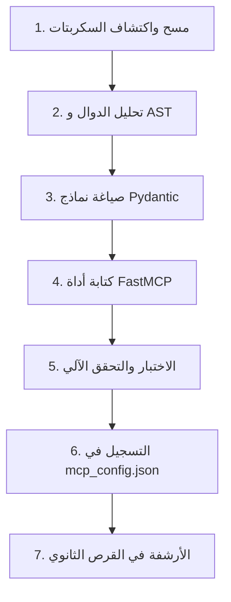

# 🛠️ مهارة تحويل سكربتات المشاريع إلى خوادم MCP (Script to MCP Converter)

مهارة متخصصة في مسح وتحليل سكربتات بايثون المستقلة أو المتناثرة داخل مجلدات المشاريع، وتجريد منطق العمل وهيكلته كأدوات معيارية مدعومة ببروتوكول سياق النموذج (Model Context Protocol - FastMCP).

---

## 🎯 الأهداف الأساسية
1. **تجريد المنطق (Logic Decoupling):** فصل كود المعالجة والإنشاء عن المسارات الثابتة (Hardcoded Paths) وعن واجهات الأوامر المباشرة.
2. **هيكلة المدخلات (Schema Definition):** بناء نماذج `Pydantic` محكمة تحدد الحقول الإلزامية والاختيارية مع التوثيق الكامل (`Field(..., description=...)`).
3. **التسجيل الموحد (FastMCP Registration):** تغليف الدوال بديكوريتور `@mcp.tool()` وتوفير استجابات نصية واضحة ومسارات الملفات المولدة.
4. **الأرشفة الآمنة (Secondary Drive Archiving):** نقل ملفات السكربتات الأصلية المبعثرة إلى مجلد الأرشيف المركزي على القرص الثانوي (`G:\_scripts_archive`) مع الحظر الصارم لأي حفظ غير ضروري على قرص النظام `C:\`.
5. **معالجة الترميز والـ RTL:** إلزام الخوادم بفرض ترميز `UTF-8` الصارم وتنسيق نصوص اللغة العربية والاتجاه من اليمين لليسار.

---

## 📋 خطوات التنفيذ القياسية (Operational Workflow)



### 1. المسح والتحليل (Discovery & AST Parsing):
- فحص مجلد المشروع واكتشاف كافة ملفات `*.py`.
- استخراج الدوال الرئيسية، المعاملات، ونوع المخرجات المتوقعة (DOCX, XLSX, PDF, JSON).

### 2. التجريد وهيكلة Pydantic (Pydantic Models):
```python
from pydantic import BaseModel, Field
from typing import List, Optional

class GenerateDocumentRequest(BaseModel):
    project_name: str = Field(..., description="اسم المشروع بالعربية")
    items: List[dict] = Field(default_factory=list, description="بيانات البنود أو الأنشطة")
    output_path: str = Field(..., description="المسار المطلق لحفظ الملف النهائي")
    template_path: Optional[str] = Field(None, description="مسار اختياري لقالب المستند")
```

### 3. بناء خادم FastMCP (Server Implementation):
```python
from fastmcp import FastMCP
import asyncio

mcp = FastMCP("project-suite-name")

@mcp.tool()
async def generate_engineering_document(request: GenerateDocumentRequest) -> str:
    """وصف واضح ودقيق لوظيفة الأداة باللغة العربية والإنجليزية"""
    result = await asyncio.to_thread(_sync_worker, request)
    return result
```

### 4. حماية الأقراص والتسجيل (Safe Registration & Archiving):
- إضافة تعريف السيرفر إلى `mcp_config.json`.
- نقل السكربتات السابقة إلى `_scripts_archive/` مع الحفاظ على الهيكل الدليلي.
- التأكد من بقاء قرص النظام `C:\` سليماً دون هدر الذاكرة.

---

## 🚫 الممارسات المحظورة (Anti-Patterns)
- ❌ حظر تجاوز معرّف الأداة الكامل `mcp_<server_name>_<tool_name>` لـ **64 حرفاً** (`^[a-zA-Z0-9_-]{1,64}$`) منعاً لتعطل الأداة في واجهة المحرر.
- ❌ حظر المسارات الصلبة (Hardcoded paths) داخل أدوات MCP.
- ❌ حظر طباعة المخرجات بدون ترميز UTF-8 على أنظمة ويندوز.
- ❌ حظر حفظ الأرشيفات أو الملفات المؤقتة الضخمة على القرص `C:\`.
- ❌ حظر حذف السكربتات القديمة قبل اختبار وتأكيد نجاح عمل أداة الـ MCP البديلة.

