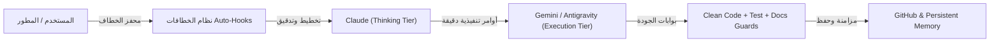

<div dir="rtl">

# سياق المشروع (PROJECT_CONTEXT.md)

> [!IMPORTANT]
> هذا الملف يمثل "عقل" المشروع ومرجعه المعماري والتقني المعتمد. يتم تحديثه ومزامنته بانتظام عبر **خطاف هندسة السياق** لضمان استقرار التوجيه وتفادي تشتت الذكاء الاصطناعي أو انحراف القرارات المعمارية عبر الجلسات المتعددة.

---

## 1. الهوية والرؤية الإستراتيجية (Identity & Strategic Seed)

* **اسم المشروع:** منظومة Claude & Antigravity - بيئة التطوير متعددة الوكلاء (`Claude-Antigravity-Workspace`).
* **النواة الإستراتيجية (Strategic Seed):** تشغيل وإدارة بيئة تشغيل برمجية متكاملة تعتمد على الأتمتة متعددة الوكلاء والمهارات المتقدمة (25+ وكيل و 80+ مهارة)، لتحقيق أعلى معايير الجودة البرمجية العالمية (Production-Grade)، والانضباط المعماري، مع الترشيد الأقصى لاستهلاك التوكنز.
* **الشخصية المستهدفة (Target Persona):** مهندسو البرمجيات والمطورون المحترفون الذين يبنون تطبيقات احترافية (Android, Web, Backend, AI Tools) باستخدام الذكاء الاصطناعي الموجه.

---

## 2. القرارات المعمارية المعتمدة (Architectural Decisions)

| المكون / الطبقة | التقنية والنموذج المعتمد | التبرير الهندسي وتوزيع التكلفة |
| :--- | :--- | :--- |
| **طبقة التخطيط والإشراف (Thinking Tier)** | Claude Sonnet 4.6 (Thinking) / Claude Opus 4.6 | تفكير عميق، تخطيط معماري دقيق، تشريح الأخطاء المعقدة، والتدقيق المعماري الصارم (Devil's Advocate). |
| **طبقة التنفيذ والترشيد (Execution Tier)** | Gemini 3.7 Flash (High) / Antigravity Engine | سرعة فائقة، نافذة سياق ضخمة، كفاءة عالية في قراءة وتعديل الملفات، وترشيد اقتصادي لاستهلاك التوكنز. |
| **نظام الخطافات التلقائي (Auto-Hooks)** | 20 خطاف تلقائي موجه بالمحفزات | استجابة فورية وتفعيل تلقائي للوكلاء بناءً على الكلمات المفتاحية دون الحاجة لإعادة توجيه يدوي. |
| **بوابات حراسة الجودة (Quality Gates)** | Clean Code + Test + Docs + Security Guards | فحص شامل لمنع أخطاء الـ AI الـ 14 الشائعة، ومنع الـ Mocks الوهمية، ومنع انحراف التوثيق (Docs Drift). |
| **نظام الذاكرة المعرفية (Memory Engine)** | `MEMORY_STORE.md` + `ACTIVE_CONTEXT_INJECTION.md` | معمارية لامركزية لحفظ الدروس المستفادة، وتطبيق بروتوكول الخطوة صفر (Step Zero Protocol) صامتاً. |
| **محرك المزامنة السحابية (Ecosystem Sync)** | `sync_global_ecosystem.py` + Git Automation | مطابقة وتحديث كافة الإضافات، المهارات، الوكلاء، والجداول ورفعها تلقائياً لمستودع GitHub. |

---

## 3. اتفاقيات التنظيم وهيكل المجلدات (Directory Structure Conventions)

```text
Claude-Antigravity-Workspace/
├── .agents/
│   ├── Sub_Agent/               # بطاقات وشخصيات الوكلاء المتخصصين الـ 25+
│   ├── skills/                  # مجلد المهارات البرمجية الموسعة (80+ مهارة)
│   ├── AGENTS.md                # الدستور المعماري وقواعد التطوير الصارمة
│   ├── HOOKS_GUIDE.md           # الدليل الفني للخطافات التلقائية الـ 20
│   ├── HOOKS_GUIDE.xlsx         # جدول الإكسيل التفاعلي المولد آلياً للخطافات
│   ├── ACTIVE_CONTEXT_INJECTION.md # قيود بروتوكول الخطوة صفر الإلزامية
│   └── convert_hooks_to_sheets.py # سكربت توليد وتحديث شيتات إكسيل الخطافات
├── 02_Multi_Agent_ChatDev_Pipeline/ # خط إنتاج التطوير التفاعلي
├── 03_Dynamic_Prompt_Library/       # تطبيق مكتبة الأوامر التفاعلية (HTML/CSS/JS)
├── 04_Self_Refinement_Engine/       # محرك التحسين الذاتي للوكلاء
├── plugins/                         # حزم الإضافات المتخصصة وتوسعات النظام
├── references/                      # المراجع المعمارية والوثائق التقنية
├── PROJECT_CONTEXT.md               # عقل وسياق المشروع المعتمد (هذا الملف)
├── USER_GUIDE.md                    # دليل الاستخدام والممارسة الشامل
├── README.md                        # المستند التعريفي العام بالمستودع
└── sync_global_ecosystem.py         # محرك مزامنة المنظومة العالمية سحابياً
```

---

## 4. القيود البرمجية واللغوية الصارمة (Hard Constraints)

1. **اللغة العربية وتنسيق RTL:** جميع الردود ومستندات المتابعة والتقارير تُكتب باللغة العربية الفصحى السليمة ومغلفة بـ `<div dir="rtl">` لضمان صحة المحاذاة في مساحات المحرر.
2. **بروتوكول الخطوة صفر (Step Zero Protocol):** يُلزم النظام بقراءة ملف `ACTIVE_CONTEXT_INJECTION.md` داخلياً وصامتاً كأول إجراء عند بدء أي مهمة برمجية.
3. **أمان الأوامر الطرفية (Sandboxing):** يُمنع تشغيل أي أمر طرفي خارجي عشوائياً دون طلب صريح من المستخدم، مع الاعتماد على أدوات البحث والقراءة الصامتة (`lean-ctx`).
4. **حراسة الكود النظيف (Clean Code Standards):**
   - الالتزام بمبادئ Clean Architecture و DRY و SOLID.
   - معالجة كافة الاستثناءات صراحة مع توفير آليات واضحة لإعادة المحاولة (Retry Mechanism).
   - تفكيك الواجهات إلى مكونات صغيرة يعاد استخدامها تحت `ui/components/`.
5. **جودة الاختبارات:** رفض الاختبارات التكرارية التافهة (Tautological Tests) ومنع الـ Mocks المفرطة، والتركيز على السلوك الفعلي للنظام وحالات الحافة (Edge Cases).

---

## 5. حالة المشروع الحالية (Current Project State)

* **المرحلة الحالية:** مرحلة الاستقرار والإنتاجية الكاملة (Production-Ready & Fully Synced).
* **المكونات النشطة والمكتملة:**
  - [x] منظومة الخطافات التلقائية الـ 20 الموثقة بالكامل في `HOOKS_GUIDE.md` و `HOOKS_GUIDE.xlsx`.
  - [x] طاقم الوكلاء المتخصصين الـ 25+ في مجلد `.agents/Sub_Agent/`.
  - [x] مكتبة المهارات البرمجية العالمية (80+ مهارة) في `.agents/skills/`.
  - [x] تطبيق مكتبة الأوامر التفاعلية الديناميكية `03_Dynamic_Prompt_Library/index.html`.
  - [x] محرك المزامنة التلقائية السحابية `sync_global_ecosystem.py` المتصل بـ GitHub.
  - [x] بروتوكول الخطوة صفر والذاكرة المعرفية المستدامة `MEMORY_STORE.md`.
* **الأهداف الحالية:**
  - [ ] التوسع في إضافة المهارات المتخصصة للمشاريع الحية.
  - [ ] المتابعة المستمرة لكفاءة وترشيد استهلاك التوكنز عبر النماذج الذكية.

---

## 6. سير عمل الوكلاء المزدوج (Dual-Agent Pipeline Workflow)



</div>
