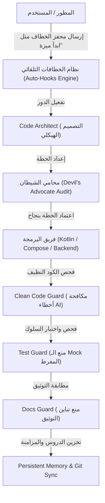

<div dir="rtl">

# 🚀 منظومة Claude & Antigravity - بيئة التطوير متعددة الوكلاء (Multi-Agent Operating System)

[](LICENSE)
[]()
[]()
[]()
[]()

مرحباً بك في المستودع المرجعي الشامل لمنظومة التطوير المتقدمة **Claude & Antigravity Multi-Agent Ecosystem**.  
تم تصميم هذه المنظومة لتمكين المطورين من تشغيل طاقم هندسي متكامل من وكلاء الذكاء الاصطناعي (AI Crew) بأعلى درجات الانضباط المعماري، والجودة البرمجية، وترشيد استهلاك التوكنز.

---

## 🌟 المعمارية الهندسية ونموذج العمل (Dual-Agent Pipeline)

تعتمد المنظومة على مبدأ **فصل المسؤوليات والتكامل المزدوج**:
* **المهندس المخطط والمشرف (Claude / Thinking Tier):** يتولى التخطيط المعماري، تحليل المسارات، التدقيق الصارم، وهندسة السياق والذاكرة.
* **المهندس المنفذ والمراجع (Antigravity / Execution Tier):** يتولى العمليات البرمجية الدقيقة، بناء الواجهات (Compose / Web)، كتابة الاختبارات، ومراقبة الكود النظيف.



---

## ⚡ التشغيل السريع على أي جهاز (Quickstart Guide)

لتثبيت وتفعيل هذه المنظومة على جهازك الخاص في دقائق معدودة:

### 1. استنساخ المستودع
```bash
git clone https://github.com/ibrahimalkateb965-tech/Claude-Antigravity-Workspace.git
cd Claude-Antigravity-Workspace
```

### 2. تفعيل المهارات والوكلاء عالمياً (Global Deployment)
لجعل جميع المهارات والوكلاء متاحة لكافة مشاريعك في بيئة Antigravity:
* **لمستخدمي Windows:**
  قم بنسخ مجلد المهارات والوكلاء إلى مسار الإعدادات العالمي للمحرر:
  ```powershell
  # إنشاء المجلدات إن لم تكن موجودة
  New-Item -ItemType Directory -Force -Path "$HOME\.gemini\config\skills"
  New-Item -ItemType Directory -Force -Path "$HOME\.gemini\config\Sub_Agent"

  # نسخ المهارات والوكلاء
  Copy-Item -Recurse -Force .agents\skills\* "$HOME\.gemini\config\skills\"
  Copy-Item -Recurse -Force .agents\Sub_Agent\* "$HOME\.gemini\config\Sub_Agent\"
  Copy-Item -Force .agents\HOOKS_GUIDE.md "$HOME\.gemini\config\HOOKS_GUIDE.md"
  Copy-Item -Force .agents\AGENTS.md "$HOME\.gemini\config\AGENTS.md"
  ```

---

## 🧭 جدول الخطافات التلقائية الـ 19 (Master Hooks Summary)

بمجرد كتابة أي من هذه الكلمات المحفزة في بداية رسالتك، يستجيب النظام فورياً بتفعيل الوكلاء والإجراءات المحددة:

| م | اسم الخطاف | المحفزات (Triggers للنسخ المباشر) | الوكلاء المسؤولون | الهدف الأساسي |
| :-: | :--- | :--- | :--- | :--- |
| **1** | **خطاف البدء والافتتاح** | `"بسم الله"`, `"بسم الله الرحمن الرحيم"` | `[prompt-engineer]`, `[agent-optimizer]` | تهيئة الجلسة، التحقق من القواعد الفنية واللغوية، وترشيد الاستهلاك. |
| **2** | **خطاف هندسة السياق** | `"سياق المشروع"`, `"هندسة السياق"` | `[prompt-engineer]`, `[agent-optimizer]` | إنشاء وتحديث ملف `PROJECT_CONTEXT.md` لضمان التوجيه وتفادي الانحراف. |
| **3** | **خطاف تصحيح المسار** | `"تصحيح مسار"`, `"تعديل البرومبت"`, `"خطأ بالخطاف"` | `[prompt-engineer]`, `[agent-optimizer]` | تشريح سبب الانحراف وإعادة توجيه الوكيل للمسار الصحيح. |
| **4** | **خطاف خط الإنتاج البرمجي** | `"ابدأ ميزة"`, `"تطوير ميزة"`, `"اصنع ميزة"` | `[code-architect]`, `[clean-code-guard]`, `[test-guard]` | دورة التطوير الكاملة (معمارية ← تدقيق ← برمجة ← حراسة الكود ← اختبار). |
| **5** | **خطاف التكامل الفني** | `"ربط API"`, `"تكامل خارجي"` | `[devops-deployer]`, `[backend-architect]` | ربط الخدمات الخارجية بعد تحصين انقطاع الشبكة وتأمين المفاتيح. |
| **6** | **خطاف تدقيق الصيانة** | `"تدقيق صيانة"`, `"مراجعة DRY"`, `"كود نظيف"` | `[code-reviewer-quality]`, `[clean-code-guard]` | مراجعة الكود ومنع التكرار وتطبيق معايير الكود النظيف. |
| **7** | **خطاف الفحص الأمني** | `"فحص أمني"`, `"مراجعة أمان"` | `[security-auditor]`, `[code-reviewer-quality]` | مسح الثغرات وفحص تشفير البيانات وصلاحيات الوصول. |
| **8** | **خطاف تحديث المكتبات** | `"تحديث الاعتماديات"`, `"تحديث المكتبات"` | `[github-talent-scout]`, `[code-architect]` | فحص Gradle والترقية الآمنة للمكتبات المتوافقة. |
| **9** | **خطاف الفحص والاختبار** | `"قم بالاختبار"`, `"جاهز للتجربة"` | `[android-testing]`, `[test-guard]` | تشغيل اختبارات السلوك الفعلي بدون Mock مفرط وضمان التغطية. |
| **10** | **خطاف معالجة الأعطال** | `"حدث خطأ"`, `"التطبيق توقف"`, `"Crash"` | `[debugger]` | تحليل الـ Stack Trace وعزل المشكلة وتطبيق الحل الأدنى الآمن. |
| **11** | **خطاف إدارة النسخ وGit** | `"نظم جيت"`, `"ارفع لجيتهاب"`, `"git commit"` | `[git-github-manager]` | تنظيم الفروع، صياغة رسائل الالتزام الاحترافية، والرفع لـ GitHub. |
| **12** | **خطاف تحديث الإنجازات** | `"حدث الإنجازات"`, `"تحديث README"` | `[git-github-manager]`, `[docs-guard]` | مطابقة التوثيق برمجياً وصياغة الإنجازات في README ورفعها. |
| **13** | **خطاف الذاكرة المستدامة** | `"حفظ ذاكرة"`, `"تحديث السياق"`, `"سجّل هذا"` | `[persistent-memory-engine]` | التقاط وتخزين الدروس والقرارات المعمارية في `MEMORY_STORE.md`. |
| **14** | **خطاف النجاح والتحليل** | `"تم بنجاح"`, `"انتهى المشروع بنجاح"` | `[agent-optimizer]` | إجراء تحليل بعدي وتحديث سجل التعلم وتطوير مهارات الفريق. |
| **15** | **خطاف ترتيب الأجهزة** | `"رتب جهازى"`, `"فرز الملفات"`, `"ترتيب ملفات"` | `[windows-c-drive-optimizer]`, `[windows-file-organizer]` | فرز ملفات الأقراص وتنظيف قرص C وتحديث الفهارس. |
| **16** | **خطاف تنظيم مسار محدد** | `"رتب المسار"`, `"نظم المجلد"`, `"ترتيب مسار"` | `[windows-file-organizer]` | تصنيف وترتيب الملفات داخل مجلد محدد بذكاء ودقة. |
| **17** | **خطاف إدارة تليجرام** | `"شغل البوت"`, `"تفعيل تليجرام"`, `"Telegram Bot"` | `[devops-deployer]`, `[persistent-memory-engine]` | تشغيل بوت تليجرام بنمط الاستماع للطلبات عن بعد. |
| **18** | **خطاف التدقيق البرمجي** | `"تدقيق الجودة"`, `"فحص الكود النظيف"`, `"clean code audit"` | `[code-reviewer-quality]`, `[clean-code-guard]`, `[test-guard]` | فحص شامل للكود النظيف، سلامة الاختبارات، ومطابقة التوثيق. |
| **19** | **خطاف تكامل الموارد** | `"استكشف المورد"`, `"حلل المستودع"`, `"integrate repo"` | `[resource-scout-integrator]`, `[github-talent-scout]` | استيراد المهارات من المستودعات الخارجية وتعميمها وتحديث المنظومة تلقائياً. |

---

## 👥 فهرس الوكلاء المتخصصين (Sub-Agents Directory)

تمتلك المنظومة أكثر من 25 وكيلاً متخصصاً موزعين عبر تخصصات دقيقة:

* 🏛️ **طبقة المعمارية والتخطيط:**
  - `[code-architect]`: تخطيط المعمارية النظيفة (Clean Architecture) ونمط MVVM/MVI.
  - `[monorepo-architect]`: إدارة وحدات وحزم الـ Monorepo.
  - `[prompt-engineer]`: صياغة وهندسة قوالب التوجيه وأنظمة الخطافات.
  - `[agent-optimizer]`: قياس كفاءة الوكلاء والحد من تكلفة التوكنز.
  - `[persistent-memory-engine]`: إدارة الذاكرة المعرفية وتصدير السياق.

* 💻 **طبقة البرمجة والتنفيذ:**
  - `[android-kotlin-pro]`: خبير Kotlin، Coroutines، Flow، وإدارة دورة الحياة.
  - `[jetpack-compose-ui]`: خبير واجهات Jetpack Compose ودعم RTL وإعادة الرسم.
  - `[frontend-design-builder]`: خبير واجهات الويب التفاعلية (HTML/CSS/JS/PWA).
  - `[offline-sync-db]`: خبير قواعد البيانات المحلية (Room DB) والمزامنة دون اتصال.
  - `[backend-architect]`: خبير الـ APIs وقواعد البيانات السحابية.

* 🛡️ **طبقة الحراسة وضمان الجودة:**
  - `[clean-code-guard]`: حارس الكود النظيف ومكافحة الأخطاء الـ 14 الشائعة لـ AI.
  - `[test-guard]`: حارس الاختبارات الهادفة ومنع Mocks الوهمية.
  - `[docs-guard]`: حارس دقة التوثيق ومطابقة الرموز البرمجية.
  - `[security-auditor]`: مراجع الثغرات الأمنية وتشفير البيانات.
  - `[debugger]`: محلل السجلات والـ Crash ومعالج المشكلات المنهجي.

* 🌐 **طبقة الاستكشاف والتكامل:**
  - `[resource-scout-integrator]`: فحص وتكامل المستودعات والموارد الخارجية وتعميمها.
  - `[github-talent-scout]`: البحث عن المكتبات المفتوحة لسد الفجوات البرمجية.
  - `[skill-forge-builder]`: بناء وهيكلة المهارات البرمجية آلياً.
  - `[git-github-manager]`: إدارة الإصدارات والـ Commits والتوثيق الآلي.

---

## 📂 هيكلية مجلدات المنظومة (Ecosystem Structure)

```text
Claude-Antigravity-Workspace/
├── .agents/
│   ├── Sub_Agent/               # إعدادات وتعاريف كافة الوكلاء الـ 25+
│   ├── skills/                  # مجلد المهارات البرمجية الـ 80+
│   ├── AGENTS.md                # الدستور المعماري وقواعد التطوير الصارمة
│   ├── HOOKS_GUIDE.md           # الدليل المفصل للخطافات التلقائية الـ 19
│   ├── HOOKS_GUIDE.xlsx         # جدول الإكسيل التفاعلي المولد تلقائياً
│   ├── ACTIVE_CONTEXT_INJECTION.md # قيود بروتوكول الخطوة صفر الإلزامية
│   └── convert_hooks_to_sheets.py # سكربت أتمتة تحويل الخطافات لملف إكسيل
├── USER_GUIDE.md                # دليل الاستخدام والممارسة التفصيلي
├── README.md                    # هذا الملف التعريفي الشامل
└── sync_global_ecosystem.py     # محرك المزامنة التلقائية للمنظومة مع GitHub
```

---

## 🤝 المشاركة والمساهمة (Contributing)

نرحب بكافة المساهمات لتطوير وتوسيع مكتبة المهارات والوكلاء:
1. قم بعمل **Fork** للمستودع.
2. أضف مهاراتك أو وكيلك الجديد تحت مجلد `.agents/skills/` أو `.agents/Sub_Agent/`.
3. شغل سكربت `python .agents/convert_hooks_to_sheets.py` لتحديث الجداول.
4. أرسل **Pull Request** لمراجعة التعديلات واعتمادها.

---

<div align="center">
  <b>تم البناء والتطوير بواسطة إبراهيم الكاتب وطاقم الوكلاء المساعدين</b> 🚀
</div>

</div>
