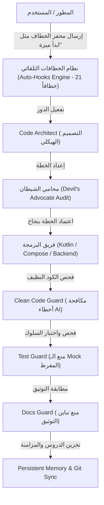

<div dir="rtl">

# 🚀 منظومة Claude & Antigravity - بيئة التطوير متعددة الوكلاء (Multi-Agent Operating System)

[](LICENSE)
[]()
[]()
[]()
[]()

مرحباً بك في المستودع المرجعي الشامل لمنظومة التطوير المتقدمة **Claude & Antigravity Multi-Agent Ecosystem**.  
تم تصميم هذه المنظومة لتمكين المطورين من تشغيل طاقم هندسي متكامل من وكلاء الذكاء الاصطناعي (AI Crew) بأعلى درجات الانضباط المعماري، والجودة البرمجية، وترشيد استهلاك التوكنز.

---

## 🌟 المعمارية الهندسية ونموذج العمل (Dual-Agent Pipeline)

تعتمد المنظومة على مبدأ **فصل المسؤوليات والتكامل المزدوج**:
* **المهندس المخطط والمشرف (Claude / Thinking Tier):** يتولى التخطيط المعماري، تحليل المسارات، التدقيق الصارم، وهندسة السياق والذاكرة.
* **المهندس المنفذ والمراجع (Antigravity / Execution Tier):** يتولى العمليات البرمجية الدقيقة، بناء الواجهات (Compose / Web)، كتابة الاختبارات، ومراقبة الكود النظيف.



---

## ⚡ التشغيل السريع على أي جهاز (Quickstart Guide)

لتثبيت وتفعيل هذه المنظومة على جهازك الخاص في ثوانٍ معدودة:

### 1. استنساخ المستودع (أو تنزيله كملف ZIP)
```bash
git clone https://github.com/ibrahimalkateb965-tech/Claude-Antigravity-Workspace.git
cd Claude-Antigravity-Workspace
```

### 2. التفعيل الشامل بنقرة واحدة (One-Click Setup)
* **لمستخدمي Windows:**
  ما عليك سوى النقر المزدوج على ملف:
  👉 **`setup_one_click.bat`** (أو تشغيل `setup_one_click.ps1` في PowerShell).
  
  *يقوم هذا السكربت آلياً بـ:*
  1. تجهيز مسار الإعدادات العالمي للمحرر (`~/.gemini/config/`).
  2. تعميم وتفعيل كافة المهارات الـ 80+ والوكلاء الـ 25+ والإضافات عالمياً لكافة مشاريعك.
  3. ربط الدساتير المعمارية وقواعد الـ 21 خطافاً ومحركات التخصيص والمزامنة.
  4. فتح تطبيق مكتبة الأوامر التفاعلية مباشرة في متصفحك.

---

## 🧭 جدول الخطافات التلقائية الـ 21 (Master Hooks Summary)

بمجرد كتابة أي من هذه الكلمات المحفزة في بداية رسالتك، يستجيب النظام فورياً بتفعيل الوكلاء والإجراءات المحددة:

| م | اسم الخطاف | المحفزات (Triggers للنسخ المباشر) | الوكلاء المسؤولون | الهدف الأساسي |
| :-: | :--- | :--- | :--- | :--- |
| **1** | **خطاف البدء والافتتاح** | `"بسم الله"`, `"بسم الله الرحمن الرحيم"` | `[prompt-engineer]`, `[agent-optimizer]` | تهيئة الجلسة، التحقق من القواعد الفنية واللغوية، وترشيد الاستهلاك. |
| **2** | **خطاف هندسة السياق** | `"سياق المشروع"`, `"هندسة السياق"` | `[prompt-engineer]`, `[agent-optimizer]` | إنشاء وتحديث ملف `PROJECT_CONTEXT.md` لضمان التوجيه وتفادي الانحراف. |
| **3** | **خطاف التخصيص والتصدير الذكي لطاقم المشروع** | `"اعتمد سياق المشروع"`, `"تخصيص وكلاء المشروع"`, `"تصدير بيئة المشروع"`, `"تخصيص الوكلاء"` | `[code-architect]`, `[agent-optimizer]`, `[prompt-engineer]` | تحليل سياق المشروع وتصدير حزم الوكلاء محلياً مع التنظيف التلقائي (Pruning) وتوليد سكربت المزامنة. |
| **4** | **خطاف الإشراف العام وتصحيح المسار** | `"تصحيح مسار"`, `"تعديل البرومبت"`, `"خطأ بالخطاف"` | `[prompt-engineer]`, `[agent-optimizer]` | تشريح سبب الانحراف وإعادة توجيه الوكيل للمسار الصحيح. |
| **5** | **خطاف خط الإنتاج البرمجي** | `"ابدأ ميزة"`, `"تطوير ميزة"`, `"اصنع ميزة"` | `[code-architect]`, `[clean-code-guard]`, `[test-guard]` | دورة التطوير الكاملة (معمارية ← تدقيق ← برمجة ← حراسة الكود ← اختبار). |
| **6** | **خطاف التكامل الفني** | `"ربط API"`, `"تكامل خارجي"` | `[devops-deployer]`, `[backend-architect]` | ربط الخدمات الخارجية بعد تحصين انقطاع الشبكة وتأمين المفاتيح. |
| **7** | **خطاف تدقيق الصيانة** | `"تدقيق صيانة"`, `"مراجعة DRY"`, `"كود نظيف"` | `[code-reviewer-quality]`, `[clean-code-guard]` | مراجعة الكود ومنع التكرار وتطبيق معايير الكود النظيف. |
| **8** | **خطاف الفحص الأمني** | `"فحص أمني"`, `"مراجعة أمان"` | `[security-auditor]`, `[code-reviewer-quality]` | مسح الثغرات وفحص تشفير البيانات وصلاحيات الوصول. |
| **9** | **خطاف تحديث المكتبات والنماذج** | `"تحديث الاعتماديات"`, `"تحديث المكتبات"`, `"تحديث النماذج"`, `"معايرة النماذج"` | `[github-talent-scout]`, `[code-architect]`, `[agent-optimizer]` | فحص Gradle واستكشاف ومعايرة النماذج الذكية عبر الإنترنت. |
| **10** | **خطاف الفحص والاختبار التلقائي** | `"قم بالاختبار"`, `"جاهز للتجربة"` | `[android-testing]`, `[test-guard]` | تشغيل اختبارات السلوك الفعلي بدون Mock مفرط وضمان التغطية. |
| **11** | **خطاف معالجة الأخطاء والأعطال** | `"حدث خطأ"`, `"التطبيق توقف"`, `"Crash"` | `[debugger]` | تحليل الـ Stack Trace وعزل المشكلة وتطبيق الحل الأدنى الآمن. |
| **12** | **خطاف إدارة النسخ والمستودعات** | `"نظم جيت"`, `"ارفع لجيتهاب"`, `"git commit"` | `[git-github-manager]` | تنظيم الفروع، صياغة رسائل الالتزام الاحترافية، والرفع لـ GitHub. |
| **13** | **خطاف تحديث الإنجازات** | `"حدث الإنجازات"`, `"تحديث README"` | `[git-github-manager]`, `[docs-guard]` | مطابقة التوثيق برمجياً وصياغة الإنجازات في README ورفعها. |
| **14** | **خطاف الذاكرة المستدامة** | `"حفظ ذاكرة"`, `"تحديث السياق"`, `"سجّل هذا"` | `[persistent-memory-engine]` | التقاط وتخزين الدروس والقرارات المعمارية في `MEMORY_STORE.md`. |
| **15** | **خطاف النجاح والتحليل البعدي** | `"تم بنجاح"`, `"انتهى المشروع بنجاح"` | `[agent-optimizer]` | إجراء تحليل بعدي وتحديث سجل التعلم وسد الثغرات البرمجية. |
| **16** | **خطاف تنظيم وترتيب الأجهزة الشامل** | `"رتب جهازى"`, `"فرز الملفات"`, `"ترتيب ملفات"` | `[windows-c-drive-optimizer]`, `[windows-file-organizer]` | فرز ملفات الأقراص وتنظيف قرص C وتحديث الفهارس. |
| **17** | **خطاف ترتيب الملفات لمسار محدد** | `"رتب المسار"`, `"نظم المجلد"`, `"ترتيب مسار"` | `[windows-file-organizer]` | تصنيف وترتيب الملفات داخل مجلد محدد بذكاء ودقة. |
| **18** | **خطاف إدارة تليجرام** | `"شغل البوت"`, `"تفعيل تليجرام"`, `"Telegram Bot"` | `[devops-deployer]`, `[persistent-memory-engine]` | تشغيل بوت تليجرام بنمط الاستماع للطلبات عن بعد. |
| **19** | **خطاف التدقيق البرمجي الشامل وحراسة الجودة** | `"تدقيق الجودة"`, `"فحص الكود النظيف"`, `"clean code audit"` | `[code-reviewer-quality]`, `[clean-code-guard]`, `[test-guard]` | فحص شامل للكود النظيف، سلامة الاختبارات، ومطابقة التوثيق. |
| **20** | **خطاف استكشاف وتكامل الموارد العالمية** | `"استكشف المورد"`, `"حلل المستودع"`, `"integrate repo"` | `[resource-scout-integrator]`, `[github-talent-scout]`, `[skill-forge-builder]` | استيراد المهارات من المستودعات الخارجية وتعميمها وتحديث المنظومة تلقائياً. |
| **21** | **خطاف المزامنة السحابية والمساهمة المجتمعية** | `"مزامنة المنظومة"`, `"sync ecosystem"`, `"ارسل pull request"`, `"مساهمة في المستودع"`, `"create PR"`, `"contribute repo"` | `[git-github-manager]`, `[persistent-memory-engine]` | للمالك: مزامنة ومطابقة كامل المنظومة ورفعها لـ GitHub. للمساهمين: تجهيز فرع الميزة وإرسال Pull Request للمستودع المركزي للمشاركة. |

---

## 👥 فهرس الوكلاء المتخصصين (Sub-Agents Directory)

تمتلك المنظومة أكثر من 25 وكيلاً متخصصاً موزعين عبر تخصصات دقيقة:

* 🏛️ **طبقة المعمارية والتخطيط:**
  - `[code-architect]`: تخطيط المعمارية النظيفة (Clean Architecture) ونمط MVVM/MVI.
  - `[monorepo-architect]`: إدارة وحدات وحزم الـ Monorepo.
  - `[prompt-engineer]`: صياغة وهندسة قوالب التوجيه وأنظمة الخطافات.
  - `[agent-optimizer]`: قياس كفاءة الوكلاء والحد من تكلفة التوكنز.
  - `[persistent-memory-engine]`: إدارة الذاكرة المعرفية وتصدير السياق.

* 💻 **طبقة البرمجة والتنفيذ:**
  - `[android-kotlin-pro]`: خبير Kotlin، Coroutines، Flow، وإدارة دورة الحياة.
  - `[jetpack-compose-ui]`: خبير واجهات Jetpack Compose ودعم RTL وإعادة الرسم.
  - `[frontend-design-builder]`: خبير واجهات الويب التفاعلية (HTML/CSS/JS/PWA).
  - `[offline-sync-db]`: خبير قواعد البيانات المحلية (Room DB) والمزامنة دون اتصال.
  - `[backend-architect]`: خبير الـ APIs وقواعد البيانات السحابية.

* 🛡️ **طبقة الحراسة وضمان الجودة:**
  - `[clean-code-guard]`: حارس الكود النظيف ومكافحة الأخطاء الـ 14 الشائعة لـ AI.
  - `[test-guard]`: حارس الاختبارات الهادفة ومنع Mocks الوهمية.
  - `[docs-guard]`: حارس دقة التوثيق ومطابقة الرموز البرمجية.
  - `[security-auditor]`: مراجع الثغرات الأمنية وتشفير البيانات.
  - `[debugger]`: محلل السجلات والـ Crash ومعالج المشكلات المنهجي.

* 🌐 **طبقة الاستكشاف والتكامل:**
  - `[resource-scout-integrator]`: فحص وتكامل المستودعات والموارد الخارجية وتعميمها.
  - `[github-talent-scout]`: البحث عن المكتبات المفتوحة لسد الفجوات البرمجية.
  - `[skill-forge-builder]`: بناء وهيكلة المهارات البرمجية آلياً.
  - `[git-github-manager]`: إدارة الإصدارات والـ Commits والتوثيق الآلي.

---

## 🏆 نماذج من مشاريعنا المنجزة بواسطة هذا المحرك (Autovem Portfolio)

1. 📱 **تطبيق تيجان النور:** منظومة متكاملة لإدارة الحلقات القرآنية ومتابعة خطط الطلاب والتسميع والتقييمات الذاتية بنمط (Offline-First).
2. 🎙️ **تطبيق القرآن الكريم للمكفوفين:** معمارية ثنائية الوضع (Dual-Mode) وتوافق قياسي بنسبة 100% مع قارئ الشاشة TalkBack وإيماءات السحب الصامتة.
3. 🏗️ **مشاريع التخطيط وحصر الكميات الهندسية:** محركات أتمتة حصر الخرسانات وحديد التسليح وتوليد جداول Primavera P6 (Sp Engine) آلياً من المخططات.

---

## 📂 هيكلية مجلدات المنظومة (Ecosystem Structure)

```text
Claude-Antigravity-Workspace/
├── 🚀 setup_one_click.bat        # سكربت التثبيت السحري بنقرة واحدة
├── 📜 setup_one_click.ps1        # المحرك البرمجي لتجهيز المسار العالمي
├── 📄 The_Zero_To_Hero_Journey_Autovem.pdf # دليل رحلة من الصفر لملف PDF تفاعلي
├── 🧠 project_agent_tailor.py    # محرك التخصيص والتنظيف التلقائي للمشاريع (الخطاف 3)
├── 🔄 sync_local_agents_template.py # قالب المزامنة الذاتية للمشاريع الفرعية
├── 🌐 sync_global_ecosystem.py   # محرك المزامنة الشاملة ومطابقة المنظومة مع GitHub
├── 📱 03_Dynamic_Prompt_Library/ # تطبيق ويب تفاعلي لنسخ الخطافات بنقرة واحدة
├── 🛡️ .agents/                    # النواة المعمارية (25+ وكيل و 80+ مهارة ودستور AGENTS.md)
└── 📘 USER_GUIDE.md & README.md  # الدليل الإرشادي والتوجيهي الشامل
```

---

## 🤝 المشاركة والمساهمة (Contributing)

نرحب بكافة المساهمات لتطوير وتوسيع مكتبة المهارات والوكلاء عبر **الخطاف 21 (`ارسل pull request`)**:
1. قم بعمل **Fork** للمستودع.
2. أضف مهاراتك أو وكيلك الجديد تحت مجلد `.agents/skills/` أو `.agents/Sub_Agent/`.
3. اكتب في المحادثة `"ارسل pull request"` أو أرسل **Pull Request** عبر GitHub مباشرة.

---

## ⭐ تواصل معنا وادعم المنظومة (Connect & Support)

يسعدنا ويشرفنا دعمكم بوضع **نجمة (Star ⭐)** على المستودع، والتواصل معنا عبر القنوات الرسمية:
* 🐙 **GitHub:** [ibrahimalkateb965-tech](https://github.com/ibrahimalkateb965-tech)
* 💼 **LinkedIn:** [Ibrahim Alkateb (PMP®)](https://www.linkedin.com/in/ibrahim-alkateb-pmp%C2%AE-7b07b1229?utm_source=share_via&utm_content=profile&utm_medium=member_android)
* 💬 **WhatsApp:** `+966 56 409 2468` ([راسلنا واتساب](https://wa.me/966564092468))

---

<div align="center">
  <b>تم البناء والتطوير بحمد الله بواسطة إبراهيم الكاتب وطاقم الوكلاء المساعدين</b> 🚀
</div>

</div>
