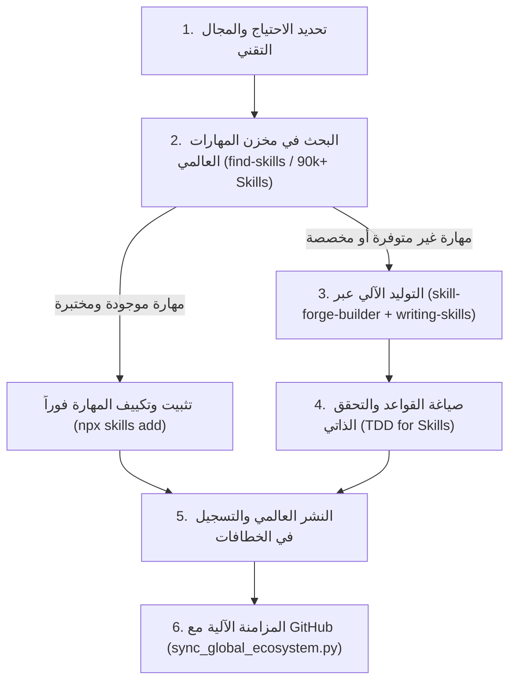

<div dir="rtl">

# 📖 دليل المستخدم الشامل لمنظومة Claude & Antigravity (USER_GUIDE.md)

هذا الدليل يشرح خطوة بخطوة كيفية الاستفادة القصوى من بيئة التطوير متعددة الوكلاء، وكيفية تفعيل واستدعاء الوكلاء والمهارات، وطريقة إدارة مسارات العمل اليومية.

---

## 📑 فهرس المحتويات

1. [نظام الخطافات التلقائية (How Hooks Work)](#1-نظام-الخطافات-التلقائية)
2. [استخدام الخطاف رقم 19 لاستيراد الموارد البرمجية](#2-استيراد-الموارد-البرمجية-عالمياً-الخطاف-19)
3. [بوابات الحراسة الثلاث (The Three Guard Gates)](#3-بوابات-الحراسة-الثلاث)
4. [بروتوكول "الخطوة صفر" وإدارة الذاكرة](#4-بروتوكول-الخطوة-صفر-وإدارة-الذاكرة)
5. [المسار المتقدم لإنشاء المهارات والوكلاء الجدد](#5-المسار-المتقدم-لإنشاء-المهارات-والوكلاء-الجدد)
6. [المزامنة الآلية والتحديثات السحابية](#6-المزامنة-الآلية-والتحديثات-السحابية)

---

## 1. نظام الخطافات التلقائية

الخطافات (Hooks) هي نظام التشغيل التلقائي للمنظومة. بدلاً من كتابة برومبتات طويلة ومعقدة في كل مرة، يكفي كتابة **الكلمة المحفزة (Trigger)** في بداية رسالتك ليقوم المحرك بالتعرف على نيتك وتفعيل الطاقم المناسب تلقائياً.

### أمثلة عملية للاستخدام اليومي:

#### 🟢 بدء جلسة عمل جديدة
* **ما تكتبه:** `"بسم الله، نريد البدء بالعمل اليوم على ميزة مشغل الصوت"`
* **ما يحدث خلف الكواليس:** يتم تفعيل `[prompt-engineer]` و `[agent-optimizer]` لمراجعة الدستور، تهيئة الجلسة، والتحقق من ترشيد استهلاك التوكنز.

#### 🔨 بناء أو تعديل ميزة معقدة
* **ما تكتبه:** `"ابدأ ميزة : إضافة خيار تكرار الآية في مشغل القرآن"`
* **ما يحدث خلف الكواليس:**
  1. يقوم `code-architect` بتصميم الهيكل المعماري.
  2. يُفعّل "محامي الشيطان" لتدقيق الخطة وتأمين قسم الآثار الجانبية `[UNINTENDED SIDE-EFFECTS]`.
  3. يبدأ المبرمج `android-kotlin-pro` أو `jetpack-compose-ui` بكتابة الكود بدقة جراحية.
  4. يتم تمرير الكود عبر `clean-code-guard` و `test-guard` قبل اعتماده.

#### 🔍 تدقيق جودة الكود واكتشاف الأخطاء الكامنة
* **ما تكتبه:** `"تدقيق الجودة : راجع ملف AudioPlayer.kt وتأكد من خلوه من أي تسريب ذاكرة أو أخطاء شائعة"`
* **ما يحدث خلف الكواليس:** يتم تفعيل بوابات الحراسة الثلاث لفحص الكود النظيف، وسلامة الاختبارات، ومطابقة التوثيق.

---

## 2. استيراد الموارد البرمجية عالمياً (الخطاف 19)

عندما تعثر على مستودع مفتوح المصدر على GitHub أو أداة برمجية جديدة وتريد فحصها والاستفادة منها:

* **ما تكتبه:**
  ```text
  استكشف المورد : https://github.com/amElnagdy/guard-skills
  حلل هذا المستودع واستخرج المهارات المفيدة وقم بتعميمها عالمياً ومزامنة المنظومة
  ```
* **ما تفعله المنظومة تلقائياً:**
  1. يفحص الوكيل `resource-scout-integrator` محتويات المستودع وأهدافه.
  2. يستخلص المهارات البرمجية المفيدة ويحولها لصيغة `SKILL.md` المعتمدة.
  3. ينسخ المهارات إلى مسار الإعدادات العالمي للمحرر (`~/.gemini/config/skills/`).
  4. يُحدث ملف `HOOKS_GUIDE.md` ويعيد توليد جدول الإكسيل `HOOKS_GUIDE.xlsx` وتطبيق مكتبة الأوامر HTML.
  5. يقوم بتشغيل محرك المزامنة `sync_global_ecosystem.py` لدفع التحديثات إلى مستودع GitHub تلقائياً.

---

## 3. بوابات الحراسة الثلاث (The Three Guard Gates)

تم تزويد المنظومة بـ 3 حراس برمجيين للحد من أخطاء نماذج الذكاء الاصطناعي الشائعة:

### 1. حارس الكود النظيف (`clean-code-guard`)
يحظر 14 خطأً معمارياً شائعاً:
- منع ابتلاع الاستثناءات (`catch (e) {}` الفارغة).
- منع التصريح بالنجاح مع استخدام بيانات وهمية (Mock Bypass).
- قصر حجم الدوال على 20-30 سطراً بمسؤولية واحدة.
- منع تكرار الكود (تطبيق صارم لمبدأ DRY).

### 2. حارس الاختبارات (`test-guard`)
- يفرض اختبار السلوك الفعلي والمخرجات القابلة للملاحظة وليس التفاصيل الداخلية.
- يمنع الإفراط في استخدام الـ Mocks للبيانات والمنطق الداخلي.
- يمنع الاختبارات المضللة أو الوهمية (Tautological Tests).

### 3. حارس التوثيق (`docs-guard`)
- يطابق كل دالة أو كلاس أو مسار مذكور في التوثيق مع الكود الحقيقي لمنع انحراف التوثيق (Docs Drift).

---

## 4. بروتوكول "الخطوة صفر" وإدارة الذاكرة

* **بروتوكول الخطوة صفر (Step Zero Protocol):**
  يُمنع على أي وكيل البدء بتوليد كود برمجي قبل قراءة ملف `ACTIVE_CONTEXT_INJECTION.md`. هذا الملف يحتوي على القيود المعمارية الإلزامية التي تحمي المشروع من تكرار أخطاء الماضي.
* **الذاكرة المعرفية المستدامة (`MEMORY_STORE.md`):**
  يتم توثيق كل درس معماري أو حل تقني جديد في ملف الذاكرة لضمان نقله عبر الجلسات والمشاريع.

---

## 5. المسار المتقدم لإنشاء المهارات والوكلاء الجدد

لضمان عدم إعادة اختراع العجلة والحفاظ على أعلى معايير الجودة، تمر عملية بناء المهارات الجديدة بمسار ذكي مؤتمت:



### الخطوة 1: تحديد النطاق والهدف (Domain Scope)
حدد بدقة ما هي المهمة المطلوبة (مثال: تحسين استعلامات قاعدة البيانات، بناء واجهات ثلاثية الأبعاد، إدارة التفرعات المعقدة).

---

### الخطوة 2: البحث الذكي عبر `[find-skills]` (مخزن الـ 90,000 مهارة)
قبل كتابة أي مهارة يدوياً، نستخدم مهارة **`[find-skills]`** للبحث في المستودع المفتوح لمجتمع الذكاء الاصطناعي (`skills.sh`):

```bash
# البحث في أكثر من 90,000 مهارة
npx skills find <search-query>

# أمثلة:
npx skills find react performance
npx skills find sqlite room database
npx skills find graphql security
```
* إذا وُجدت مهارة مجتمعية عالية التقييم (أكثر من 1K+ تثبيت ومن مصادر موثوقة)، يتم تثبيتها مباشرة:
  ```bash
  npx skills add <owner/repo@skill> -g -y
  ```

---

### الخطوة 3: التوليد الآلي عبر `[skill-forge-builder]` و `[writing-skills]`
إذا كانت المهارة مخصصة لمشروعك أو جديدة تماماً، يتم استدعاء الوكيل **`skill-forge-builder`** بالاعتماد على منهجية **`writing-skills`** لبناء مجلد وهيكل المهارة بدلاً من إنشائها يدوياً:

* **يقوم الوكيل آلياً بـ:**
  1. إنشاء المجلد `.agents/skills/<skill-name>/`.
  2. صياغة ملف `SKILL.md` مع الترويسة القياسية (YAML Frontmatter):
     ```markdown
     ---
     name: <skill-name>
     description: "وصف واضح للمهارة ومتى يتم استدعاؤها والمشكلة التي تحلها."
     ---
     ```
  3. تضمين القواعد الإلزامية (Imperatives)، والأنماط الممنوعة (Anti-Patterns)، وقائمة الفحص الذاتي (Delivery Checklist).

---

### الخطوة 4: إنشاء وتخصيص الوكيل الفرعي (Sub-Agent)
عند الحاجة لإنشاء وكيل فرعي متخصص يستخدم المهارة الجديدة:
1. يتم إنشاء ملف `.agents/Sub_Agent/<agent-name>.yaml`:
   ```yaml
   ---
   name: expert-agent-name
   description: "الدور التخصصي للوكيل ونطاق عمله الدقيق"
   tools: Glob, Grep, Read, Skill, WebSearch
   model: thinking # خيارات: flash / pro / thinking
   color: cyan
   skills: new-skill-name, clean-code-guard
   ```
2. تسجيل الوكيل في الفهرس المركزي `.agents/Sub_Agent/sub_agents.yaml`.

---

### الخطوة 5: الربط بالخطافات المناسبة
* يتم إسناد المهارة أو الوكيل الجديد إلى الخطاف المعني في ملف `HOOKS_GUIDE.md`.

---

### الخطوة 6: المزامنة السحابية الشاملة
تشغيل أمر المزامنة الشامل:
```bash
python .agents/sync_global_ecosystem.py
```
يقوم السكربت تلقائياً بتحديث ملف الإكسيل `HOOKS_GUIDE.xlsx`، وتطبيق مكتبة الأوامر `index.html`، ونشر المهارة عالمياً في `~/.gemini/config/skills/`، ورفع المستودع لـ GitHub بنقرة واحدة.

---

## 6. المزامنة الآلية والتحديثات السحابية

لتحديث ومزامنة كافة المهارات والوكلاء والدستور مع مستودع GitHub في أي وقت، يمكنك تشغيل الأمر التالي من سطر الأوامر:

```bash
python .agents/sync_global_ecosystem.py
```

يقوم هذا السكربت تلقائياً بنسخ كافة الإعدادات والمهارات الجديدة محلياً وعالمياً، وتحديث المستودع العام، وإجراء الالتزام والرفع لـ GitHub بنقرة واحدة.

---

<div align="center">
  <b>Claude & Antigravity Multi-Agent Ecosystem</b><br>
  صُممت لتوفير تجربة تطوير فائقة الجودة والموثوقية 🚀
</div>

</div>
