# 🧭 معمارية وحالة أسطول الـ CLIs التشاركي (Multi-CLI Fleet Architecture)

> **تم تصميم هذا المخطط وفق أعلى معايير الذكاء التصميمي [UI/UX Pro Max] ومطابق لأداة [Autovem Flowchart Studio]، مع العزل الصارم للنصوص ثنائية الاتجاه (BiDi Isolation) وتكامل لوحة ألوان Dark Neon Candy.**

---

## 📊 كود المخطط الانسيابي المعماري (Mermaid Architecture Code)

```mermaid
flowchart TD
    %% فئات التنسيق البصري UI/UX Pro Max - Dark Neon Candy (High Granularity)
    classDef master fill:#111827,stroke:#06b6d4,stroke-width:2px,color:#ffffff,rx:8px,ry:8px;
    classDef terminal fill:#2e1065,stroke:#a855f7,stroke-width:2px,color:#ffffff,rx:8px,ry:8px;
    classDef ui fill:#022c22,stroke:#10b981,stroke-width:2px,color:#ffffff,rx:8px,ry:8px;
    classDef workbench fill:#1e1b4b,stroke:#6366f1,stroke-width:2px,color:#ffffff,rx:8px,ry:8px;
    classDef gate fill:#500724,stroke:#ec4899,stroke-width:2px,color:#ffffff,rx:8px,ry:8px;
    classDef clear fill:#451a03,stroke:#f59e0b,stroke-width:2px,color:#ffffff,rx:8px,ry:8px;

    subgraph CommandLayer [" 👑 القيادة والتنسيق المركزي (Fleet Orchestration) "]
        direction TB
        Claude_Lead["👑 <b>Claude Code CLI <span dir='ltr'>[Opus Max]</span></b><br/><span dir='ltr' style='color:#38bdf8;font-size:11px;'>Master Orchestrator &amp; Test Monopoly</span>"]:::master
        Devils_Advocate["⚖️ <b>تدقيق محامي الشيطان</b><br/><small style='color:#94a3b8;font-size:10px;'>فحص الثغرات المعمارية والآثار الجانبية</small>"]:::master
        Task_Decomp["📋 <b>تفكيك المهام وتحديد النطاق</b><br/><small style='color:#94a3b8;font-size:10px;'>صياغة قوالب التكليف Template 02</small>"]:::master

        IDE_Cockpit["🖥️ <b>Antigravity IDE <span dir='ltr'>[Gemini 3.8 Flash]</span></b><br/><span dir='ltr' style='color:#818cf8;font-size:11px;'>Developer Cockpit &amp; Workbench</span>"]:::workbench
        Diff_Inspect["👁️ <b>معاينة الـ Diffs والتعديلات</b><br/><small style='color:#94a3b8;font-size:10px;'>فحص بصري فوري قبل الاعتماد</small>"]:::workbench
        Memory_Guard["🧠 <b>حراسة الذاكرة المستدامة</b><br/><small style='color:#94a3b8;font-size:10px;'>مزامنة MEMORY_STORE.md و ADRs</small>"]:::workbench
    end

    subgraph DelegationLayer [" ⚡ المنفذون الطرفيون الذاتيون (Headless CLI Execution - No Testing) "]
        direction TB
        subgraph OpenCodeBox [" ⚙️ مسار OpenCode CLI [Meta Muse Spark 1.3] "]
            direction TB
            OC_Head["⚙️ <b>OpenCode CLI المنفذ الطرفي</b><br/><code dir='ltr' style='font-size:10px;'>opencode run &quot;...&quot;</code>"]:::terminal
            OC_DB["🗄️ <b>قواعد البيانات &amp; Drift ORM</b><br/><small style='color:#d8b4fe;font-size:10px;'>بناء المخططات وترحيل الجداول</small>"]:::terminal
            OC_Net["🌐 <b>عملاء الشبكة &amp; Repositories</b><br/><small style='color:#d8b4fe;font-size:10px;'>توليد DAOs وعملاء API</small>"]:::terminal
            OC_Term["⚡ <b>الطرفية وسكربتات CI</b><br/><small style='color:#d8b4fe;font-size:10px;'>أوامر البناء وترحيل الكاش</small>"]:::terminal
            OC_Failover["🔄 <b>التراجع الديناميكي الذكي</b><br/><small style='color:#d8b4fe;font-size:10px;'>Gemini ➔ Llama ➔ Ollama محلي</small>"]:::terminal
        end

        subgraph AgCliBox [" 🎨 مسار Antigravity CLI [agcli - Gemini 3.8 Flash] "]
            direction TB
            Ag_Head["🎨 <b>Antigravity CLI المنفذ الذاتي</b><br/><code dir='ltr' style='font-size:10px;'>agcli run &quot;...&quot;</code>"]:::ui
            Ag_UI["📱 <b>واجهات Compose &amp; SwiftUI</b><br/><small style='color:#6ee7b7;font-size:10px;'>تفكيك الشاشات والمكونات التفاعلية</small>"]:::ui
            Ag_Domain["📐 <b>عقود الـ Domain &amp; UseCases</b><br/><small style='color:#6ee7b7;font-size:10px;'>منطق العمل المستقل وحالات الاستخدام</small>"]:::ui
            Ag_CodeGen["🤖 <b>التوليد البرمجي الذاتي</b><br/><small style='color:#6ee7b7;font-size:10px;'>بناء الملفات ذاتياً دون تدخل يدوي</small>"]:::ui
        end
    end

    subgraph QualityLayer [" 🛡️ بوابات الجودة واحتكار الاختبارات (Quality Gate & Testing Monopoly) "]
        direction TB
        subgraph StaticGateBox [" 🔍 بوابة الفحص الثابت للمنفذين "]
            Gate_Static["🔍 <b>فحص خلو الأخطاء</b><br/><span dir='ltr' style='color:#cbd5e1;font-size:11px;'>flutter analyze = 0 errors</span>"]:::workbench
            Gate_Clean["🧹 <b>حراسة الكود النظيف</b><br/><small style='color:#94a3b8;font-size:10px;'>فحص مبادئ DRY و KISS واستقلالية UI</small>"]:::workbench
        end

        subgraph ClaudeTestBox [" 🧪 بوابة احتكار الفحص لـ Claude Code "]
            Test_Mono["👑 <b>سلطة الاختبار الحصرية لـ Claude</b><br/><code dir='ltr' style='font-size:10px;'>flutter test / allTests</code>"]:::gate
            Test_Unit["🔬 <b>اختبارات الوحدة (Unit Tests)</b><br/><small style='color:#f472b6;font-size:10px;'>فحص ViewModels والـ Business Logic</small>"]:::gate
            Test_Integ["🔗 <b>اختبارات التكامل (Integration)</b><br/><small style='color:#f472b6;font-size:10px;'>فحص Drift DB ومحاكاة MockK</small>"]:::gate
            Test_Edge["🛡️ <b>تدقيق الحالات الحدية والآثار الجانبية</b><br/><small style='color:#f472b6;font-size:10px;'>فحص دورة الحياة وإدارة الموارد</small>"]:::gate
        end

        Final_Approve["✅ <b>الاعتماد الهندسي النهائي</b><br/><span style='color:#34d399;font-weight:bold;font-size:11px;'>[QUALITY GATE: PASS]</span><br/><small style='color:#e2e8f0;font-size:10px;'>تسجيل ADR ودمج الفرع بأمان</small>"]:::ui
    end

    subgraph StrategicClearLayer [" 🔄 خطاف التصفير الاستراتيجي (Hook 25: Strategic Clear) "]
        direction TB
        SC_Trigger["⚠️ <b>رصد كوتا الجلسة</b><br/><span dir='ltr' style='color:#fbbf24;font-size:10px;'>session:80% / Preventative 40%</span>"]:::clear
        SC_Tasks["1️⃣ <b>حسم وتثبيت المهام</b><br/><small style='color:#fde68a;font-size:10px;'>إنهاء العمل عند نقطة مستقرة 100% Green</small>"]:::clear
        SC_Memory["2️⃣ <b>تجميد الحالة والذاكرة</b><br/><small style='color:#fde68a;font-size:10px;'>تحديث CURRENT_STATE &amp; MEMORY_STORE</small>"]:::clear
        SC_Git["🔒 <b>تأمين وحفظ Git</b><br/><small style='color:#fde68a;font-size:10px;'>حفظ الـ Commits وتأمين الفرع</small>"]:::clear
        SC_Prompt["3️⃣ <b>برومبت الاستئناف الفوري</b><br/><code dir='ltr' style='font-size:10px;'>Read CLAUDE.md &amp; CURRENT_STATE...</code>"]:::master
        SC_Resume["🧼 <b>تنفيذ /clear والاستئناف النظيف</b><br/><small style='color:#38bdf8;font-size:10px;'>استعادة كوتا 40% وبدء جلسة جديدة فوراً</small>"]:::master
    end

    %% روابط التنسيق والقيادة
    Claude_Lead --> Devils_Advocate
    Devils_Advocate --> Task_Decomp
    IDE_Cockpit --> Diff_Inspect
    IDE_Cockpit --> Memory_Guard
    IDE_Cockpit -.->|مراقبة المطور وتوجيه استراتيجي| Claude_Lead

    %% تدفق التفويض البرمجي للمنفذين
    Task_Decomp ==>|1. أمر تكليف مهيكل Template 02| OC_Head
    Task_Decomp ==>|1. أمر تكليف مهيكل Template 02| Ag_Head

    %% تفريعات المنفذين
    OC_Head --> OC_DB
    OC_Head --> OC_Net
    OC_Head --> OC_Term
    OC_Term -.->|في حال تعثر المزود| OC_Failover

    Ag_Head --> Ag_UI
    Ag_Head --> Ag_Domain
    Ag_Head --> Ag_CodeGen

    %% التسليم لبوابة الفحص الثابت
    OC_DB --> Gate_Static
    OC_Net --> Gate_Static
    OC_Term --> Gate_Static
    Ag_UI --> Gate_Static
    Ag_Domain --> Gate_Static
    Ag_CodeGen --> Gate_Static
    Gate_Static --> Gate_Clean

    %% التسليم للاحتكار الحصري لـ Claude Code
    Gate_Clean ==>|2. تقديم الـ Diffs نظيفة 0 errors| Test_Mono
    Test_Mono --> Test_Unit
    Test_Mono --> Test_Integ
    Test_Mono --> Test_Edge

    Test_Unit ==> Final_Approve
    Test_Integ ==> Final_Approve
    Test_Edge ==> Final_Approve
    Final_Approve -.->|توثيق ADR وحفظ القرار| Memory_Guard

    %% تدفق التصفير الاستراتيجي
    Final_Approve -.->|استمرار خط الإنتاج حتى امتلاء الكوتا| SC_Trigger
    SC_Trigger ==> SC_Tasks
    SC_Tasks ==> SC_Memory
    SC_Memory ==> SC_Git
    SC_Git ==> SC_Prompt
    SC_Prompt ==> SC_Resume
    SC_Resume ==>|استئناف الجلسة الجديدة بدون أي هدر للسياق| Claude_Lead
```

---

## 🎯 المبادئ الجوهرية المعروضة في المخطط:

1. **القيادة الثنائية المتكاملة:**
   - `Claude Code CLI (Opus Max)`: القيادة المعمارية، التدقيق الصارم، والمراجعة الفنية.
   - `Antigravity IDE (Gemini 3.8 Flash High)`: بيئة العمل التفاعلية والتحكم المركزي لحاضنة المطور.
2. **المنفذون الطرفيون الذاتيون (Autonomous Headless CLIs):**
   - `OpenCode CLI`: اختصاص الطرفية وقواعد البيانات والـ CI.
   - `Antigravity CLI (agcli)`: اختصاص الواجهات وعقود ومنطق الـ Domain عبر الاستدعاء المباشر دون نسخ ولصق يدوي.
3. **احتكار الفحص الصارم (Testing Monopoly):**
   - المنفذون يفحصون البناء الثابت فقط (`flutter analyze = 0`).
   - `Claude Code CLI` هو المخول الوحيد حصرياً بتشغيل الاختبارات (`flutter test` / `allTests`) وإصدار قرار الاعتماد `[APPROVED]`.
4. **بروتوكول التصفير الاستراتيجي (Hook 25: Strategic Clear):**
   - إنهاء المهام الحرجة ➔ تجميد الحالة وتأمين Git ➔ توليد برومبت الاستئناف ➔ تنفيذ `/clear` بأمان تام 100%.

