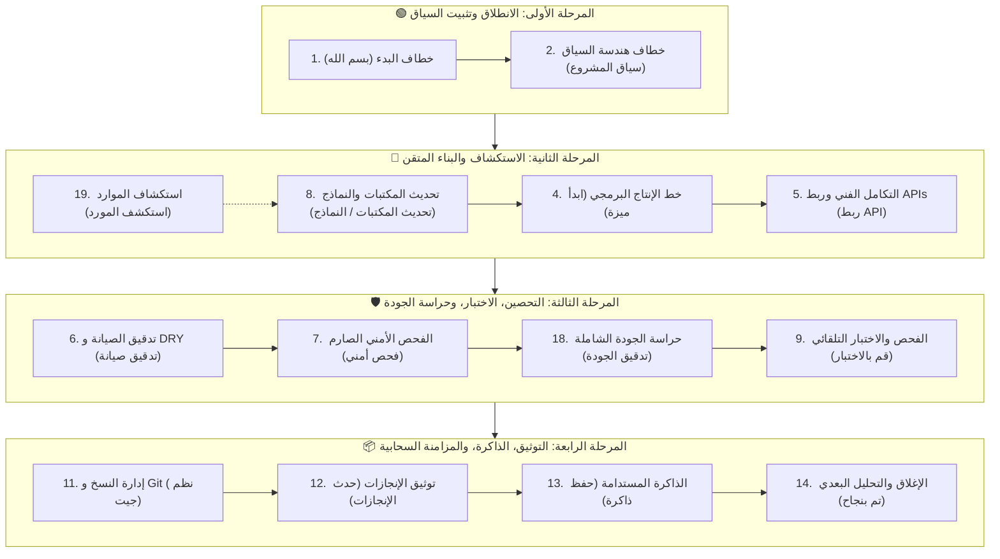

<div dir="rtl">

# 🏭 دليل المستخدم الشامل: إدارة خط الإنتاج عبر الخطافات (Hooks Pipeline Guide)

مرحباً بك في غرفة التحكم. هذا الدليل يوضح لك **الترتيب الزمني الصارم** لاستخدام الخطافات التلقائية (من الخطاف الأول وحتى الخطاف رقم 19) لإدارة دورة حياة تطوير أي ميزة أو مشروع بنجاح من بداية الجلسة وحتى تسليمها وتوثيقها ومزامنتها سحابياً.

---

## 🗺️ الترتيب الزمني الصارم لدورة حياة الميزة (Chronological Pipeline)



---

### 🟢 المرحلة الأولى: الانطلاق وتثبيت السياق (Session Kickoff)
*تُستخدم في بداية كل جلسة عمل جديدة قبل كتابة أي كود.*

1. **الخطاف #1 (خطاف البدء والافتتاح)**
   - **كلمة التفعيل:** `بسم الله` أو `بسم الله الرحمن الرحيم`
   - **النموذج المقترح:** `Gemini 3.7 Flash (High)`
   - **الهدف:** إيقاظ النظام، تفعيل اللغة العربية وتنسيق RTL، ومراجعة الدستور وترشيد استهلاك التوكنز.

2. **الخطاف #2 (خطاف هندسة السياق)**
   - **كلمة التفعيل:** `سياق المشروع` أو `هندسة السياق`
   - **النموذج المقترح:** `Claude Sonnet 4.6 (Thinking)`
   - **الهدف:** استدعاء ومراجعة القواعد العالمية والمحلية (`AGENTS.md`)، وتحديث ملف `PROJECT_CONTEXT.md` واستيراد الذاكرة العالمية لمنع الانحراف التقني.

---

### 🚀 المرحلة الثانية: الاستكشاف والبناء البرمجي (Discovery & Feature Pipeline)
*هنا تبدأ عملية استكشاف الموارد وبرمجة الميزة الجديدة خطوة بخطوة.*

3. **الخطاف #19 (خطاف استكشاف وتكامل الموارد العالمية) - *عند استيراد مكتبات أو مستودعات خارجية***
   - **كلمة التفعيل:** `استكشف المورد : <رابط>` أو `حلل المستودع`
   - **النموذج المقترح:** `Claude Sonnet 4.6 (Thinking)`
   - **الهدف:** فحص المستودعات الخارجية مفتوحة المصدر، استخراج وتوليد المهارات آلياً عبر `skill-creator` و `find-skills`، ونشرها عالمياً ومزامنة المنظومة تلقائياً.

4. **الخطاف #8 (خطاف مراجعة وتحديث المكتبات والنماذج الذكية)**
   - **كلمة التفعيل:** `تحديث الاعتماديات` أو `تحديث المكتبات` أو `تحديث النماذج` أو `معايرة النماذج`
   - **النموذج المقترح:** `Gemini 3.7 Flash (High)`
   - **الهدف:** تحديث إصدارات Gradle والمكتبات، وفحص بوابات الإنترنت الرسمية (`antigravity.google` و `google.dev`) لتحديث مصفوفة النماذج الذكية آلياً دون لقطات شاشة.

5. **الخطاف #4 (خطاف خط الإنتاج البرمجي لبناء الميزات) - *العمود الفقري للنظام***
   - **كلمة التفعيل:** `ابدأ ميزة : <اسم الميزة>` أو `تطوير ميزة`
   - **النموذج المقترح:** `Claude Sonnet 4.6 (Thinking)` / البديل: `Claude Opus 4.6 (Thinking)`
   - **الهدف:**
     - رسم المعمارية الهيكلية للميزة (`code-architect`).
     - **[تدقيق محامي الشيطان لـ 7 مرات متتالية]**: تمزيق خطة التنفيذ وسد الثغرات وتأمين قسم الآثار الجانبية `[UNINTENDED SIDE-EFFECTS]` حتى الوصول لنسبة نجاح 99.99%.
     - **[التنفيذ الجراحي الدقيق]**: حقن المبرمج بقيد يمنعه تماماً من كسر أو حذف الأكواد السابقة.
     - الفحص الأولي لبوابات الكود النظيف والاختبارات.

6. **الخطاف #5 (خطاف التكامل الفني وربط الخدمات)**
   - **كلمة التفعيل:** `ربط API` أو `تكامل خارجي`
   - **النموذج المقترح:** `Gemini 3.7 Flash (High)`
   - **الهدف:** عزل منطق الربط الخارجي، وتأمين المفاتيح في متغيرات البيئة، وبناء `Interceptors` لتحمل انقطاع الشبكة.

---

### 🛡️ المرحلة الثالثة: التحصين، الاختبار، وحراسة الجودة (Audit & QA)
*لا يتم الانتقال لهذه المرحلة إلا بعد اكتمال كود الميزة.*

7. **الخطاف #6 (خطاف تدقيق الصيانة)**
   - **كلمة التفعيل:** `تدقيق صيانة` أو `مراجعة DRY`
   - **النموذج المقترح:** `Claude Sonnet 4.6 (Thinking)`
   - **الهدف:** إزالة التكرار، تبسيط الكود المعقد، وحذف الأكواد الميتة، وتحسين أداء الرسم في Compose.

8. **الخطاف #7 (خطاف الفحص الأمني الصارم)**
   - **كلمة التفعيل:** `فحص أمني` أو `مراجعة أمان`
   - **النموذج المقترح:** `Claude Sonnet 4.6 (Thinking)`
   - **الهدف:** مسح `AndroidManifest` والـ Intents والتحقق من تشفير البيانات الحساسة وصحة المدخلات.

9. **الخطاف #18 (خطاف التدقيق البرمجي الشامل وحراسة الجودة)**
   - **كلمة التفعيل:** `تدقيق الجودة` أو `فحص الكود النظيف` أو `clean code audit`
   - **النموذج المقترح:** `Claude Sonnet 4.6 (Thinking)`
   - **الهدف:** تشغيل بوابات الحراسة الثلاث:
     - 🛡️ **حارس الكود النظيف (`clean-code-guard`)**: منع ابتلاع الأخطاء وتضخم الدوال.
     - 🧪 **حارس جودة الاختبارات (`test-guard`)**: التحقق من فحص السلوك الفعلي ومنع الـ Mocks الزائفة.
     - 📝 **حارس التوثيق (`docs-guard`)**: مطابقة الرموز والمسارات لمنع اختلاق التوثيق.

10. **الخطاف #9 (خطاف الفحص والاختبار التلقائي)**
    - **كلمة التفعيل:** `قم بالاختبار` أو `جاهز للتجربة`
    - **النموذج المقترح:** `Claude Sonnet 4.6 (Thinking)`
    - **الهدف:** كتابة وتشغيل اختبارات الوحدة للحالات الناجحة والفاشلة والطرفية وفق معايير صارمة.

---

### 📦 المرحلة الرابعة: التوثيق، الذاكرة، والمزامنة السحابية (Wrap-up & Sync)
*تُستخدم لإنهاء الجلسة وحفظ الذاكرة المعرفية ورفع التعديلات إلى GitHub.*

11. **الخطاف #11 (خطاف إدارة النسخ والمستودعات)**
    - **كلمة التفعيل:** `نظم جيت` أو `ارفع لجيتهاب` أو `git commit`
    - **النموذج المقترح:** `Gemini 3.7 Flash (High)`
    - **الهدف:** فحص التعديلات، كتابة رسائل Commit احترافية، وحل التعارضات ورفع الكود إلى GitHub بأمان.

12. **الخطاف #12 (خطاف تحديث الإنجازات)**
    - **كلمة التفعيل:** `حدث الإنجازات` أو `تحديث README`
    - **النموذج المقترح:** `Gemini 3.7 Flash (High)`
    - **الهدف:** صياغة التعديلات كإنجازات واضحة، وتحديث ملف `README.md` والرفع التلقائي.

13. **الخطاف #13 (خطاف الذاكرة المستدامة) - *جوهري لبناء الوعي***
    - **كلمة التفعيل:** `حفظ ذاكرة` أو `تحديث السياق`
    - **النموذج المقترح:** `Claude Sonnet 4.6 (Thinking)`
    - **الهدف:** استخراج القرارات المعمارية العميقة والدروس وحفظها في `MEMORY_STORE.md` لتكون مرجعاً دائماً للمشاريع المستقبلية.

14. **الخطاف #14 (خطاف النجاح والتحليل البعدي)**
    - **كلمة التفعيل:** `تم بنجاح` أو `انتهى المشروع بنجاح`
    - **النموذج المقترح:** `Claude Sonnet 4.6 (Thinking)`
    - **الهدف:** إجراء تحليل بعدي (Post-Mortem)، وتحديث سجل التعلم، وسد أي فجوات تقنية.

---

## 🚨 خطافات الطوارئ وتصحيح المسار (Emergency & Rerouting)
*تُستخدم **في أي لحظة** خارج الترتيب الزمني لمعالجة الانحرافات أو الأعطال.*

* **الخطاف #3 (خطاف الإشراف العام وتصحيح المسار)**
  - **كلمة التفعيل:** `تصحيح مسار` أو `تعديل البرومبت` أو `خطأ بالخطاف`
  - **النموذج المقترح:** `Claude Sonnet 4.6 (Thinking)`
  - **متى يُستخدم؟** عند انحراف الوكيل، الوقوع في حلقة مفرغة، أو كسر القواعد المعمارية؛ يقوم بتشريح الخطأ وإعادة توجيه المسار تلقائياً.

* **الخطاف #10 (خطاف معالجة الأخطاء والأعطال)**
  - **كلمة التفعيل:** `حدث خطأ` أو `Crash` أو `التطبيق توقف`
  - **النموذج المقترح:** `Claude Sonnet 4.6 (Thinking)`
  - **متى يُستخدم؟** عند انهيار التطبيق أو ظهور استثناء غير متوقع لتحليل الـ Stack Trace وإصلاحه بأقل تدخل جراحي.

---

## 🛠️ خطافات الصيانة وإدارة النظام والأجهزة (Utilities & Operations)

* **الخطاف #15 (خطاف تنظيم وترتيب الأجهزة الشامل)**
  - **كلمة التفعيل:** `رتب جهازى` أو `فرز الملفات` | **النموذج:** `Gemini 3.7 Flash`
  - **الهدف:** فرز وتصنيف جذور الأقراص وتنظيف قرص C.

* **الخطاف #16 (خطاف ترتيب الملفات لمسار محدد)**
  - **كلمة التفعيل:** `رتب المسار` أو `نظم المجلد` | **النموذج:** `Gemini 3.6 Flash`
  - **الهدف:** تنظيم ملفات مجلد معين حسب النوع والتاريخ.

* **الخطاف #17 (خطاف إدارة تليجرام)**
  - **كلمة التفعيل:** `شغل البوت` أو `تفعيل تليجرام` | **النموذج:** `Gemini 3.5 Flash`
  - **الهدف:** تشغيل بوت تليجرام بنمط الاستماع الفردي الموفر للطاقة في الخلفية.

---

## 🚀 قيادة أسطول الـ CLIs التشاركي (Multi-CLI Fleet Orchestration)

* **الخطاف #22 (خطاف قيادة وإدارة الأسطول التشاركي)**
  - **كلمة التفعيل:** `أسطول الـ CLIs` أو `تشغيل الأسطول` أو `تنسيق الأسطول` أو `fleet orchestrator` أو `multi cli fleet`
  - **النموذج المقترح:** `Claude Opus 4.6 (Thinking)` / البديل: `Gemini 3.7 Flash (High)`
  - **الهدف والإجراءات التلقائية:**
    1. **التوليد والتهيئة التلقائية (Auto-Provisioning):** فحص وجود مجلد `fleet_templates/` وملف `fleet_config.json` في المشروع، وتوليدهما فوراً من النظام المركزي عند عدم وجودهما.
    2. **توزيع مهام الأسطول:** تقسيم الأدوار بدقة (`Claude Code CLI [Opus Max]` للمراجعة والمعمارية الصارمة، `OpenCode CLI [Ox Alpha Unlimited]` لتنفيذ الطرفية وقواعد البيانات وبناء الكود، `Antigravity IDE [Gemini 3.7 Flash]` لبناء الواجهات وعقود الـ Domain وإدارة الذاكرة).
    3. **التحول المستدام لنمط المحادثة (Session-Wide Fleet Mode):** بمجرد استدعاء الخطاف 22، تتحول كافة الأوامر والمحادثات التالية تلقائياً إلى أوامر تفويض مهيكلة (Template 02/03) باللغة الإنجليزية موجهة لأفراد الأسطول دون الحاجة لإعادة طلب الخطاف.
    4. **حوكمة بوابات الجودة (Quality Gates):** مراجعة diffs كل مرحلة وتوثيق القرارات المعمارية ADRs في `MEMORY_STORE.md`.
    5. **بروتوكول إدارة الكوتا (Quota Failover):** استلام ومواصلة القيادة البرمجية فور نفاد كوتا أي نموذج دون أي انقطاع.

---

## 🔌 تحويل وأتمتة سكربتات المشاريع إلى أدوات MCP (Script to MCP Engine)

* **الخطاف #23 (خطاف تحويل وأتمتة سكربتات المشاريع إلى خوادم MCP)**
  - **كلمة التفعيل:** `حول إلى MCP` أو `تحويل سكربتات لـ MCP` أو `بناء أدوات MCP` أو `convert scripts to mcp` أو `scripts to mcp`
  - **النموذج المقترح:** `Claude Sonnet 4.6 (Thinking)` / البديل: `Gemini 3.7 Flash (High)`
  - **الهدف والإجراءات التلقائية:**
    1. **مسح وتحليل السكربتات:** استكشاف جميع ملفات `*.py` المستقلة في المشروع عبر `project_scripts_to_mcp.py` واستخراج منطق الدوال والمعاملات.
    2. **تجريد الكود وبناء نماذج Pydantic:** عزل المسارات الثابتة وبناء مخططات معيارية للمدخلات والمخرجات.
    3. **التجميع في خادم FastMCP:** توليد وتسجيل أدوات الـ MCP في ملف `mcp_config.json` للـ IDE والوكلاء.
    4. **الأرشفة الآمنة في القرص الثانوي (G:):** نقل السكربتات الأصلية القديمة بأمان إلى مجلد `_scripts_archive` على القرص الثانوي دون التأثير على مساحة قرص C:.

---

## 🤖 أتمتة مسارات العمل ووكلاء n8n الذكية (n8n AI Agent Workflow Engine)

* **الخطاف #24 (خطاف أتمتة مسارات العمل ووكلاء n8n الذكية)**
  - **كلمة التفعيل:** `ابني مسار n8n` أو `أتمتة n8n` أو `وكيل n8n` أو `n8n ai agent` أو `n8n workflow`
  - **النموذج المقترح:** `Claude Sonnet 4.6 (Thinking)` / البديل: `Gemini 3.7 Flash (High)`
  - **الهدف والإجراءات التلقائية:**
    1. **التصميم المعماري للمسار:** اختيار الأنماط المتقدمة (Multi-Agent Router, ReAct Tools Agent, Evaluator-Optimizer Loop, Human-in-the-Loop).
    2. **بناء أدوات الاستدعاء ومخططات JSON:** توليد قوالب HTTP Request و Custom JS مع فرض JSON Schema صارم يمنع هلوسة المعاملات.
    3. **إدارة طبقات الذاكرة:** ربط الذاكرة القصيرة ومخازن المتجهات RAG (Qdrant/Pinecone/Supabase) عبر نودات n8n.
    4. **أتمتة خطوط التسويق والـ CRM:** بناء مسارات مؤتمتة لمعالجة وتأهيل العملاء المحتملين من Google Ads وتنبيهات WhatsApp اللحظية.
    5. **تحصين الأعطال:** تفعيل Error Trigger و Exponential Backoff ونماذج LLM الاحتياطية لضمان استقرار العمليات بنسبة 99.9%.

---

## ⚡ أمر المزامنة الشاملة بنقرة واحدة
في أي وقت تريد مزامنة كافة المهارات، الوكلاء، جداول الإكسيل، وتطبيق مكتبة الأوامر HTML مع مستودع GitHub الرئيسي:

```bash
python .agents/sync_global_ecosystem.py
```

</div>
