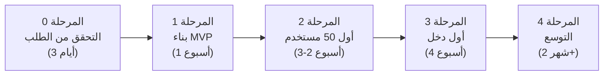

# مراجعة نقدية وخطة تنفيذية مُحسَّنة (النسخة 2.0)

> [!IMPORTANT]
> هذه المراجعة صريحة وقاسية عمداً. الهدف هو حمايتك من إهدار الوقت والمال، وليس التشجيع الأعمى.

---

## 📋 الجزء الأول: المراجعة النقدية للخطة الأصلية

### ❌ نقاط الضعف الجوهرية التي تم اكتشافها

#### 1. السوق مشبع بالفعل — المنافسة شرسة
الخطة الأصلية اقترحت بناء "محرك إعادة تدوير المحتوى" دون تحليل المنافسين الحقيقيين. الواقع:

| المنافس الموجود فعلاً | السعر الشهري | ما يفعله |
| :--- | :--- | :--- |
| **OpusClip** | مجاني - 19$ | تحويل فيديوهات طويلة إلى مقاطع قصيرة بالذكاء الاصطناعي |
| **Repurpose.io** | 24$ - 99$ | أتمتة النشر على 30+ منصة |
| **Tugan.ai** | مجاني - 29$ | تحويل نص/رابط إلى منشورات ونشرات بريدية |
| **Taskade Genesis** | 10$ | محرك محتوى شامل متعدد المخرجات |

> [!CAUTION]
> **الخلاصة:** الدخول بمنتج عام "يعيد تدوير المحتوى" يعني منافسة شركات لديها ملايين الدولارات في التمويل. هذا انتحار تجاري بميزانية 400 ريال.

#### 2. الجدول الزمني غير واقعي (3 أيام!)
- **اليوم 1:** بناء MVP كامل + Landing Page ← هذا وحده يحتاج 2-4 أسابيع لمطور محترف متفرغ
- **اليوم 2:** ربط محرك الذكاء الاصطناعي حياً ← يحتاج اختبار مكثف وضبط المطالبات
- **اليوم 3:** إطلاق وجمع أموال ← لا يوجد مستخدمين بعد ليدفعوا

#### 3. الميزانية فيها بنود مبكرة لا داعي لها
- **65 ريال لخدمة البريد:** لا تحتاجها قبل أن يكون لديك 100+ مشترك (الخدمات المجانية تكفي)
- **45 ريال لاسم النطاق:** يمكن تأجيله واستخدام نطاق فرعي مجاني من Vercel
- **100 ريال احتياطي إعلانات:** إعلانات بـ 27$ لن تحقق شيئاً يُذكر

#### 4. خلط وكيل Jetpack Compose في مشروع ويب
الخطة وضعت `[jetpack-compose-ui]` في مسار بناء واجهات الويب — هذا وكيل مخصص لتطبيقات Android فقط ولا علاقة له بالويب.

#### 5. غياب خطة التحقق من الطلب (Validation)
**أخطر نقطة:** الخطة تقفز مباشرة للبناء دون التأكد أن هناك أشخاصاً مستعدين للدفع. هذا هو السبب الأول لفشل 90% من المشاريع.

---

## 📋 الجزء الثاني: الخطة المُحسَّنة (النسخة 2.0)

### 🎯 التحول الاستراتيجي: من "إعادة تدوير المحتوى" إلى "حل مشكلة محددة جداً"

بدلاً من منافسة OpusClip وRepurpose.io في سوق مشبع، نستهدف **شريحة مهملة تماماً** لا يخدمها أحد:

### المنتج المُعدَّل: `HookPulse` — مولّد الخطافات والسكريبتات باللغة العربية

> **المشكلة الحقيقية:** صناع المحتوى العرب (ملايين على TikTok و YouTube Shorts) لا يملكون أي أداة ذكاء اصطناعي مخصصة تفهم ثقافتهم ولهجاتهم لكتابة خطافات جذابة وسكريبتات فيديوهات قصيرة.

| الميزة | التفصيل |
| :--- | :--- |
| **الجمهور** | صناع محتوى عرب (TikTok / Reels / Shorts) — سوق ضخم ومهمل |
| **القيمة** | كتابة 10 خطافات + سكريبت فيديو كامل من فكرة واحدة بالعربية في 30 ثانية |
| **الميزة التنافسية** | لا يوجد منافس واحد يقدم هذا باللغة العربية بجودة عالية |
| **لماذا سينجح** | الطلب موجود فعلاً (ابحث في TikTok عن "كيف اكتب هوك" أو "سكريبت ريلز") |

---

### 🏗️ المراحل التنفيذية المُعدَّلة (واقعية وقابلة للقياس)

---

### المرحلة 0: التحقق من الطلب قبل كتابة سطر واحد (3 أيام)

> [!WARNING]
> **لا تتخطَّ هذه المرحلة أبداً.** إذا لم تجد 15 شخصاً مهتماً فعلاً، غيّر الفكرة فوراً.

| المهمة | التفصيل | المسؤول |
| :--- | :--- | :--- |
| **كتابة 5 منشورات اختبارية** | منشورات على X و TikTok تسأل: "لو كان فيه أداة تكتبلك خطافات وسكريبتات بالعربي... تشترك؟" | `[post-content-writer]` |
| **جمع 15 ردّ إيجابي** | إذا لم تحصل عليها → غيّر الزاوية أو الجمهور | أنت شخصياً |
| **تحليل الردود** | فهم ما يريدونه بالضبط: هل يريدون خطافات فقط؟ سكريبتات كاملة؟ أفكار فيديوهات؟ | `[customer-research-voice]` |

**التكلفة: 0 ريال**

---

### المرحلة 1: بناء MVP بسيط يعمل فعلاً (أسبوع واحد)

> [!IMPORTANT]
> الـ MVP ليس منصة كاملة. هو صفحة واحدة فيها حقل إدخال وزر واحد ونتيجة واحدة.

#### ما سنبنيه بالضبط:
1. **صفحة ويب واحدة** (ليست منصة — صفحة واحدة فقط):
   - حقل إدخال: "اكتب فكرة فيديوك"
   - زر: "ولّد الخطافات والسكريبت"
   - النتيجة: 10 خطافات + سكريبت كامل بالعربية
2. **صفحة هبوط بسيطة** مع نموذج تسجيل قائمة الانتظار

#### توزيع الفريق المتوازي:

| المسار | المسؤول | المهمة المحددة |
| :--- | :--- | :--- |
| **Frontend** | `[code-architect]` + `[frontend-design-builder]` | صفحة واحدة بتصميم داكن فاخر + RTL كامل |
| **AI Engine** | `[ai-engineer]` + `[prompt-engineer]` | كتابة وضبط مطالبات توليد الخطافات العربية |
| **Landing Page** | `[cro-conversion-lead]` + `[copywriting-lead]` | صفحة هبوط تحتوي عرض Lifetime Deal |
| **محتوى تسويقي** | `[post-content-writer]` + `[script-hook-generator]` | 10 منشورات Build in Public جاهزة للنشر |

**التكلفة: 0 ريال** (كل شيء على Free Tier)

---

### المرحلة 2: الحصول على أول 50 مستخدم حقيقي (أسبوع 2-3)

| القناة | الطريقة | الهدف |
| :--- | :--- | :--- |
| **TikTok** | فيديو قصير يُظهر الأداة وهي تعمل حياً (Screen Recording) | 20 تسجيل |
| **X (تويتر)** | سلسلة تغريدات "بنيت أداة ذكاء اصطناعي بالعربي في أسبوع" | 15 تسجيل |
| **مجتمعات صناع المحتوى** | مشاركة مباشرة في مجموعات التليجرام والديسكورد العربية | 15 تسجيل |

**التكلفة: 0 ريال** (تسويق بالمحتوى فقط — لا إعلانات)

---

### المرحلة 3: أول دخل حقيقي (أسبوع 4)

| الإجراء | التفصيل |
| :--- | :--- |
| **تفعيل الدفع** | ربط LemonSqueezy (مجاني، عمولة فقط) |
| **عرض Lifetime Deal** | 19$ لأول 50 مستخدم (بدلاً من 29$ — سعر أقل = تحويل أعلى) |
| **الهدف الواقعي** | 20 مبيعة × 19$ = **380$** (~1,425 ريال) ← استرداد الميزانية كاملة + ربح |

---

### المرحلة 4: التوسع وإعادة الاستثمار (شهر 2+)

- إضافة ميزات جديدة بناءً على طلبات المستخدمين الفعلية (وليس التخمين)
- تحويل المنتج من Lifetime Deal إلى اشتراك شهري (9$/شهر)
- التوسع إلى سوق صناع المحتوى باللغة الإنجليزية

---

## 💰 الميزانية المُحسَّنة (400 ريال سعودي)

> [!TIP]
> القاعدة الذهبية: **لا تصرف ريالاً واحداً قبل التحقق من الطلب (المرحلة 0).** ابدأ بالصفر، واصرف فقط عندما تتأكد أن هناك أشخاصاً مستعدين للدفع.

| البند | التكلفة | متى تصرفها | السبب |
| :--- | :--- | :--- | :--- |
| **رصيد Groq API (مجاني) + OpenAI API** | 150 ريال (40$) | بعد المرحلة 0 فقط | Groq مجاني للاختبار، OpenAI للإنتاج عند وجود مستخدمين |
| **اسم النطاق (.com)** | 45 ريال (12$) | بعد المرحلة 1 | استخدم `hookpulse.vercel.app` مجاناً حتى تتأكد من الفكرة |
| **احتياطي لتحسين المنتج** | 205 ريال (54$) | بعد المرحلة 2 | ترقية Supabase أو Vercel إذا زاد الاستخدام |
| **المجموع** | **400 ريال** | **مُوزَّعة على مراحل** | **لا تُصرف دفعة واحدة** |

**خدمات مجانية بالكامل (Free Tier):**
- **Vercel:** استضافة الموقع (100GB bandwidth/شهر)
- **Supabase:** قاعدة بيانات + تسجيل المستخدمين (500MB + 50K MAU)
- **Groq API:** معالجة ذكاء اصطناعي مجانية (~30 طلب/دقيقة)
- **LemonSqueezy:** استلام المدفوعات (عمولة فقط، بدون رسوم شهرية)
- **Resend:** خدمة بريد إلكتروني (3,000 إيميل/شهر مجاناً)
- **GitHub:** استضافة الكود المصدري

---

## 📋 ما نحتاجه منك الآن (قائمة التهيئة المُحدَّثة)

### مطلوب فوراً (قبل البدء):

1. **✅ الموافقة على تغيير الاتجاه:**
   - هل توافق على التركيز على **"مولّد الخطافات والسكريبتات بالعربية"** بدلاً من منصة إعادة تدوير المحتوى العامة؟

2. **✅ اختيار اسم المنتج:**
   - اقتراحنا: `HookPulse` (قصير، عالمي، سهل التذكر)
   - بديل: `خطّاف` / `Khattaf` (عربي، مميز، يصف المنتج مباشرة)

3. **✅ حساب GitHub:**
   - هل لديك حساب GitHub؟ سنحتاجه لاستضافة الكود والنشر على Vercel

### مطلوب لاحقاً (بعد المرحلة 0):

4. **مفتاح OpenAI API أو Groq API** (بعد التحقق من الطلب)
5. **حساب LemonSqueezy** لاستلام المدفوعات (بعد المرحلة 2)
6. **شراء اسم النطاق** (بعد المرحلة 1)

---

## 🔑 الفرق الجوهري بين الخطة القديمة والمحسّنة

| البُعد | الخطة القديمة ❌ | الخطة المحسّنة ✅ |
| :--- | :--- | :--- |
| **السوق** | منافسة شركات بملايين الدولارات | استهداف شريحة مهملة (عرب) لا يخدمها أحد |
| **الجدول الزمني** | 3 أيام (غير واقعي) | 4 أسابيع بمراحل واضحة وقابلة للقياس |
| **التحقق من الطلب** | غائب تماماً | المرحلة 0 إلزامية قبل كتابة أي كود |
| **الميزانية** | تُصرف دفعة واحدة | مُوزَّعة على مراحل — لا تصرف إلا بعد التحقق |
| **MVP** | منصة كاملة معقدة | صفحة واحدة بحقل إدخال وزر ونتيجة |
| **أول دخل** | "اليوم 3" (خيالي) | أسبوع 4 بعد 50 مستخدم حقيقي (واقعي) |
| **معيار النجاح** | غير محدد | 20 مبيعة = 380$ = استرداد الميزانية + ربح |

---

> [!NOTE]
> **الخلاصة:** الثروة الحقيقية لا تُبنى بمنتج ضخم يُطلق بين ليلة وضحاها. تُبنى بحل مشكلة حقيقية لأشخاص حقيقيين مستعدين للدفع، ثم التوسع تدريجياً. هذه الخطة المحسّنة تضمن ذلك.

